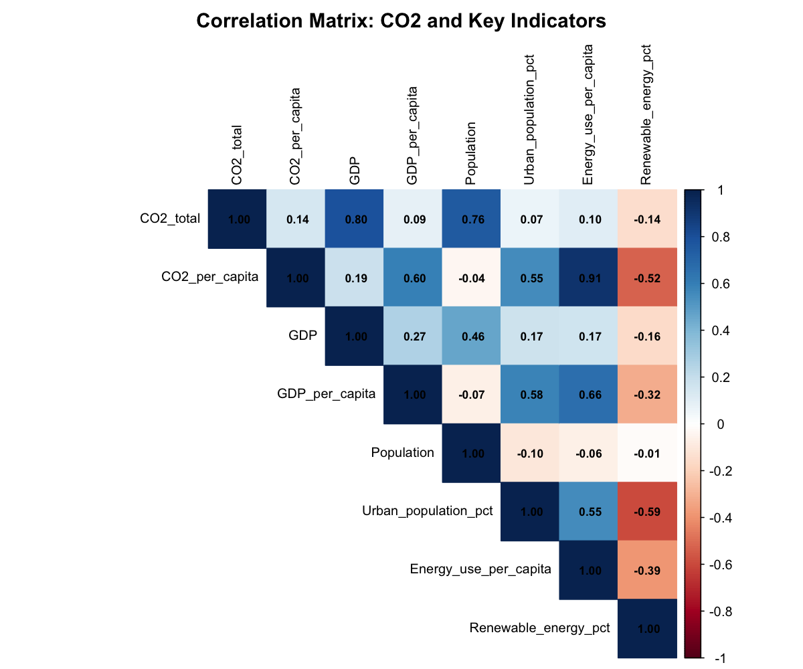

# Question 1: Comprehensive Data Acquisition and Preprocessing

## Overview
This report summarizes the data acquisition, preprocessing, and exploratory analysis of CO2 emissions and socio-economic indicators from the World Bank database.

## Data Sources
- **Database**: World Bank World Development Indicators (WDI)
- **Time Period**: 2000-2023 (24 years, depending on the country)
- **Countries**: 215 countries (after removing regional aggregates)
- **Total Observations**: 5,160

## Indicators Downloaded

### CO2 and Environment
1. **CO2_total** (EN.GHG.CO2.MT.CE.AR5): Total CO2 emissions (Mt CO2e)
2. **CO2_per_capita** (EN.GHG.CO2.PC.CE.AR5): CO2 emissions per capita (t CO2e/capita)
3. **CO2_transport** (EN.GHG.CO2.TR.MT.CE.AR5): CO2 from transport (Mt CO2e)
4. **CO2_intensity_GDP** (EN.GHG.CO2.RT.GDP.KD): Carbon intensity of GDP

### Economic Indicators
5. **GDP** (NY.GDP.MKTP.CD): GDP in current US$
6. **GDP_per_capita** (NY.GDP.PCAP.CD): GDP per capita in current US$
7. **GDP_growth** (NY.GDP.MKTP.KD.ZG): Annual GDP growth (%)

### Population
8. **Population** (SP.POP.TOTL): Total population
9. **Urban_population_pct** (SP.URB.TOTL.IN.ZS): Urban population (%)
10. **Population_growth** (SP.POP.GROW): Population growth (annual %)

### Energy
11. **Energy_use_per_capita** (EG.USE.PCAP.KG.OE): Energy use per capita
12. **Electricity_access** (EG.ELC.ACCS.ZS): Access to electricity (%)
13. **Renewable_energy_pct** (EG.FEC.RNEW.ZS): Renewable energy consumption (%)
14. **Electric_power_consumption** (EG.USE.ELEC.KH.PC): Electric power consumption (kWh per capita)

### Other Indicators
15. **Education_expenditure** (SE.XPD.TOTL.GD.ZS): Government education spending (% of GDP)
16. **Industry_value_added** (NV.IND.TOTL.ZS): Industry value added (% of GDP)
17. **Largest_city_pop** (EN.URB.LCTY): Population in largest city
18. **Forest_area_pct** (AG.LND.FRST.ZS): Forest area (% of land area)

## Data Cleaning Steps

### 1. Removal of Aggregates
- Removed regional and income-level aggregates
- Kept only individual countries
- Filtering criteria: `region != "Aggregates"` and `!is.na(region)`

### 2. Data Quality Assessment
- **Overall Completeness**: 89.61%
- **CO2 Data Availability**: 93.5% (201 out of 215 countries have data)
- Missing data handled through analysis; no imputation performed at this stage

## Descriptive Statistics

### Summary Statistics for Key Variables

| Variable | Mean | Median | SD | Min | Max | Q1 | Q3 |
|----------|------|--------|-------|-----|-----|----|----|
| CO2_total (Mt) | 160.00 | 9.12 | 791.00 | 0.00 | 13,000.00 | 1.28 | 60.80 |
| CO2_per_capita (t) | 4.90 | 2.30 | 8.91 | 0.00 | 203.00 | 0.58 | 6.20 |
| GDP (current USD) | 3.27×10¹¹ | 1.82×10¹⁰ | 1.50×10¹² | 13.96M | 2.73×10¹³ | 4.26B | 1.23×10¹¹ |
| GDP_per_capita (USD) | 16,100 | 5,410 | 25,000 | 110 | 257,000 | 1,566 | 20,700 |
| Population | 3.30×10⁷ | 5.74×10⁶ | 1.31×10⁸ | 9,544 | 1.44×10⁹ | 685,604 | 2.12×10⁷ |
| Energy_use_per_capita (kg oil eq.) | 2,390 | 1,350 | 2,950 | 9.73 | 21,600 | 540 | 2,950 |
| Renewable_energy_pct (%) | 29.70 | 19.10 | 29.30 | 0.00 | 98.30 | 4.50 | 49.80 |

*Full table available at: `results/tables/descriptive_statistics.csv`*

### Top 10 CO2 Emitters (Average 2015-2023)

1. **China** - 11,769 Mt CO2e (Per capita: 8.39 t)
2. **United States** - 4,874 Mt CO2e (Per capita: 14.8 t)
3. **India** - 2,546 Mt CO2e (Per capita: 1.83 t)
4. **Russian Federation** - 1,835 Mt CO2e (Per capita: 12.7 t)
5. **Japan** - 1,128 Mt CO2e (Per capita: 8.93 t)
6. **Iran, Islamic Rep.** - 716 Mt CO2e (Per capita: 8.23 t)
7. **Germany** - 706 Mt CO2e (Per capita: 8.53 t)
8. **Korea, Rep.** - 639 Mt CO2e (Per capita: 12.4 t)
9. **Indonesia** - 612 Mt CO2e (Per capita: 2.24 t)
10. **Saudi Arabia** - 601 Mt CO2e (Per capita: 19.3 t)

*Full ranking available at: `results/tables/top_10_emitters.csv`*

### Key Insights from Descriptive Statistics

- **CO2 Emissions Distribution**: Highly right-skewed distribution with median (9.12 Mt) far below mean (160 Mt), indicating a few large emitters dominate global emissions. China alone accounts for approximately 30% of global emissions.

- **Economic Disparities**: Significant variation in GDP per capita (median $5,410) reflects global economic inequality. Wealthier nations show higher per capita emissions despite similar total emissions in some cases.

- **Energy Consumption Patterns**: Strong variation in energy use (SD: 2,950 kg oil equivalent per capita) correlates with development level. Renewable energy adoption remains modest (median: 19.1%) with significant room for improvement.

- **Per Capita Emissions**: Saudi Arabia leads in per capita emissions (19.3 t), while India, despite being the 3rd largest total emitter, has relatively low per capita emissions (1.83 t), highlighting the role of population size.

## Correlation Analysis

### Strongest Correlations with CO2 Total Emissions:
1. **GDP** (0.80): Larger economies tend to have higher total emissions
2. **Population** (0.76): More populous countries emit more CO2 in absolute terms
3. **GDP_per_capita** (0.09): Weak correlation, suggesting development level alone doesn't drive total emissions

### Strongest Correlations with CO2 Per Capita:
1. **Energy_use_per_capita** (0.91): Strongest predictor of per capita emissions
2. **GDP_per_capita** (0.60): Wealthier countries have higher per capita emissions
3. **Urban_population_pct** (0.55): More urbanized countries tend to have higher emissions

### Notable Negative Correlations:
1. **Renewable_energy_pct** with CO2_per_capita (-0.52): Countries with more renewable energy have lower per capita emissions
2. **Renewable_energy_pct** with Energy_use_per_capita (-0.39): Renewable energy usage reduces overall energy consumption intensity

## Files Generated
1. `data/raw/world_bank_raw_data.csv`: Original downloaded data
2. `data/processed/world_bank_clean_data.csv`: Cleaned data with original variable names
3. `data/processed/world_bank_clean_renamed.csv`: Cleaned data with readable variable names
4. `results/figures/correlation_matrix.png`: Correlation heatmap
5. `results/tables/descriptive_statistics.csv`: Summary statistics table
6. `results/tables/top_10_emitters.csv`: Top emitting countries

## Conclusion
The dataset is comprehensive and suitable for predictive modeling. Key findings show that economic development (GDP), population size, and energy consumption patterns are the primary drivers of CO2 emissions. Renewable energy adoption shows promise as a mitigation strategy, with a clear negative correlation to per capita emissions.

The data preprocessing ensures high quality with 89.61% completeness, and the wide range of socio-economic indicators provides a solid foundation for building predictive models in subsequent questions.