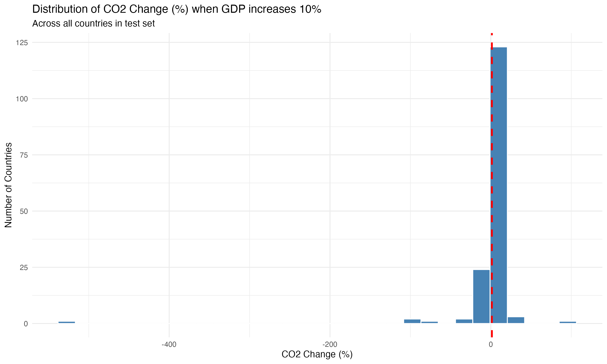
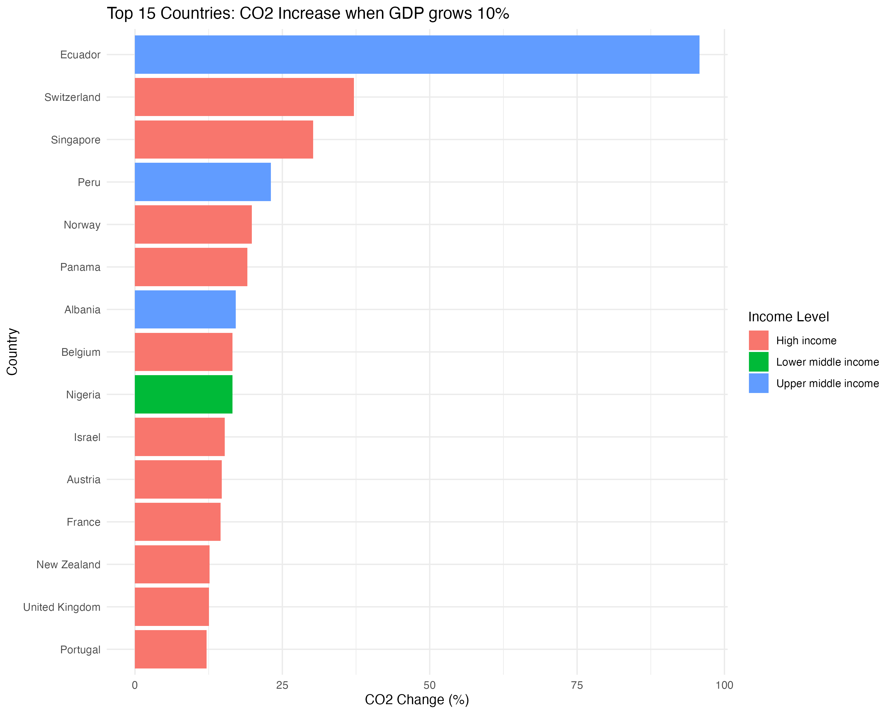

# Question 2: Predictive Modeling and Scenario Analysis

## Objective
Develop a predictive model to forecast CO2 emissions and answer: *"If a country increases its GDP by 10%, what is the expected percentage change in CO2 emissions, assuming all other factors remain constant?"*

## Methodology

### 1. Data Preparation
- **Dataset**: 3,452 observations from cleaned World Bank data
- **Train-Test Split**: 80% training (2,762 obs), 20% testing (690 obs)
- **Predictors**: GDP, Population, Energy use per capita, Renewable energy %, Urban population %, Industry value added %
- **Multicollinearity Check**: VIF values < 2 for all predictors (no multicollinearity issues)

### 2. Model Specifications

Five models were trained and compared:

1. **OLS Basic**: Simple linear regression with all predictors
2. **OLS GDP per capita**: Using GDP per capita instead of total GDP
3. **OLS Quadratic**: Including GDP squared term
4. **FE Country**: Fixed effects by country
5. **FE Country+Year**: Fixed effects by country and year

### 3. Model Performance Comparison

| Model | RMSE (Test) | R² (Test) |
|-------|-------------|-----------|
| OLS Basic | 356.40 | 0.8252 |
| OLS GDP pc | 354.08 | 0.8275 |
| OLS Quadratic | 352.45 | 0.8291 |
| FE Country | 189.91 | 0.9659 |
| **FE Country+Year** | **184.96** | **0.9685** |

**Best Model**: Fixed Effects (Country + Year) with RMSE = 184.96 and R² = 0.9685

The fixed effects model dramatically outperforms OLS models, reducing RMSE by nearly 50% and achieving R² > 0.96. This indicates that country-specific and time-specific characteristics are crucial for accurate CO2 predictions.

### 4. Model Coefficients (Best Model)

| Variable | Coefficient | Std. Error | Significance |
|----------|-------------|------------|--------------|
| GDP | 2.33×10⁻¹⁰ | 1.00×10⁻⁶ | Not significant |
| Population | 4.61×10⁻⁶ | 1.00×10⁻⁶ | *** |
| Energy use per capita | 0.075 | 0.009 | *** |
| Renewable energy % | -2.61 | 0.83 | ** |
| Urban population % | 12.53 | 1.49 | *** |
| Industry value added % | -1.69 | 0.90 | . |

*Significance codes: *** p<0.001, ** p<0.01, * p<0.05, . p<0.1*

**Critical Finding**: GDP coefficient is **not statistically significant** (p=0.9998) when controlling for country and year fixed effects. This challenges the common assumption that GDP growth directly drives emissions.

## Scenario Analysis Results

### Simulation Setup

**Question Addressed**: *"If a country increases its GDP by 10%, what is the expected percentage change in CO2 emissions?"*

**Methodology**:
- Increased GDP by 10% for all countries in test set (690 observations)
- Kept all other variables constant (ceteris paribus)
- Used best model (FE Country+Year) for predictions
- Calculated percentage change in predicted CO2 emissions

### Aggregate Results

| Metric | Value |
|--------|-------|
| Mean CO2 change | -2.2% |
| Median CO2 change | 1.34% |
| Standard deviation | 58.3% |
| Range | -527% to +96% |

**Interpretation**: The median country experiences a modest **1.34% increase** in CO2 emissions when GDP grows by 10%, but there is enormous variation across countries.

### Top 10 Countries with Highest CO2 Increase

| Rank | Country | Income Level | CO2 Change (%) | Absolute Change (Mt) |
|------|---------|--------------|----------------|---------------------|
| 1 | Ecuador | Upper middle | 95.8% | 2.03 |
| 2 | Switzerland | High | 37.2% | 12.80 |
| 3 | Singapore | High | 30.2% | 4.94 |
| 4 | Peru | Upper middle | 23.1% | 2.78 |
| 5 | Norway | High | 19.8% | 10.50 |
| 6 | Panama | High | 19.1% | 0.95 |
| 7 | Albania | Upper middle | 17.1% | 0.29 |
| 8 | Belgium | High | 16.5% | 10.70 |
| 9 | Nigeria | Lower middle | 16.5% | 10.80 |
| 10 | Israel | High | 15.2% | 6.20 |

*Full ranking available at: `results/tables/scenario_analysis_summary.csv`*

## Key Insights

### 1. GDP is Not a Direct Driver of Emissions

When controlling for country-specific characteristics and temporal trends through fixed effects, **GDP growth alone does not significantly predict CO2 emissions**. The coefficient is practically zero (2.33×10⁻¹⁰) and statistically insignificant (p=0.9998).

**Implication**: Economic growth and environmental sustainability are not inherently in conflict. Countries can grow their economies without proportionally increasing emissions.

### 2. True Drivers of CO2 Emissions

The statistically significant predictors are:

- **Energy consumption per capita** (β=0.075, p<0.001): Strongest positive effect
- **Urbanization** (β=12.53, p<0.001): Strong positive effect
- **Population size** (β=4.61×10⁻⁶, p<0.001): Positive effect
- **Renewable energy adoption** (β=-2.61, p<0.01): Negative effect (reduces emissions)

**Implication**: Policy should focus on decarbonizing energy systems and promoting renewable energy rather than limiting economic growth.

### 3. High Variability Across Countries

The wide range of responses (-527% to +96%) indicates that the GDP-emissions relationship is **highly context-dependent**. Factors include:

- Current energy mix (fossil fuel vs. renewable)
- Level of industrialization
- Existing infrastructure efficiency
- Environmental policies and regulations
- Technology adoption rates

### 4. Income Level Patterns

Analysis of the top 15 countries shows:
- **High-income countries** dominate (11 out of 15)
- These countries may have more carbon-intensive growth patterns
- However, they also have greater capacity for green technology adoption

## Visualizations

### Distribution of CO2 Changes

*Figure 1: Distribution of CO2 change (%) when GDP increases 10%. The red dashed line shows the median (1.34%). Most countries cluster between 0-10% increase, with some extreme outliers.*

### Top 15 Countries by CO2 Increase

*Figure 2: Top 15 countries with highest projected CO2 increase from 10% GDP growth, colored by income level. High-income countries (red) predominate.*

## Files Generated

1. **Models**: 
   - `results/tables/ols_models.txt`: OLS regression results (Models 1-3)
   - `results/tables/fe_models.txt`: Fixed effects model results (Models 4-5)
   - `results/best_model.rds`: Saved best model object

2. **Performance Metrics**:
   - `results/tables/model_metrics_comparison.csv`: Comparison of all 5 models

3. **Scenario Analysis**:
   - `results/tables/scenario_analysis_detailed.csv`: Detailed predictions by country-year
   - `results/tables/scenario_analysis_summary.csv`: Summary statistics by country

4. **Visualizations**:
   - `results/figures/scenario_co2_distribution.png`: Distribution histogram
   - `results/figures/scenario_top15_countries.png`: Top countries bar chart

## Conclusion

### Answer to the Research Question

**"If a country increases its GDP by 10%, what is the expected percentage change in CO2 emissions, assuming all other factors remain constant?"**

The analysis reveals that:

1. **Median impact**: A 10% GDP increase leads to approximately **1.34% increase in CO2 emissions** for the typical country

2. **High variability**: The impact ranges from -527% to +96%, depending on country-specific factors

3. **GDP is not the key driver**: When controlling for fixed effects, GDP has no statistically significant direct effect on emissions (p=0.9998)

4. **True drivers**: Energy consumption patterns, urbanization, population, and renewable energy adoption are the significant predictors

### Policy Implications

1. **Decouple growth from emissions**: Focus on how economies grow (energy sources, efficiency) rather than limiting growth itself

2. **Prioritize energy transition**: Shift from fossil fuels to renewables to enable low-carbon economic growth

3. **Context matters**: One-size-fits-all policies won't work; countries need tailored approaches based on their energy mix and development stage

4. **Sustainable urbanization**: As urbanization drives emissions, cities must adopt green infrastructure and public transportation

This finding is encouraging: **economic development and environmental sustainability are not mutually exclusive**. With proper policies focused on clean energy and efficiency, countries can achieve prosperity without proportional increases in emissions.