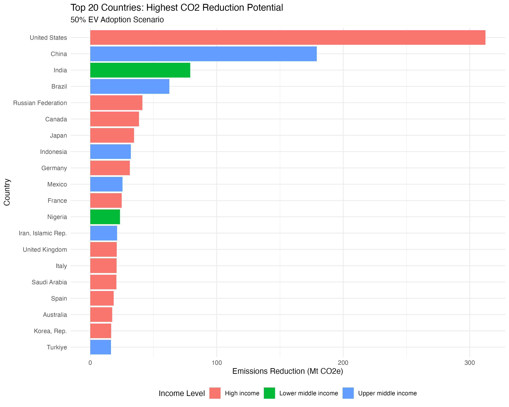
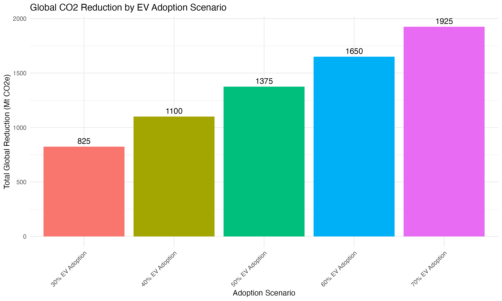
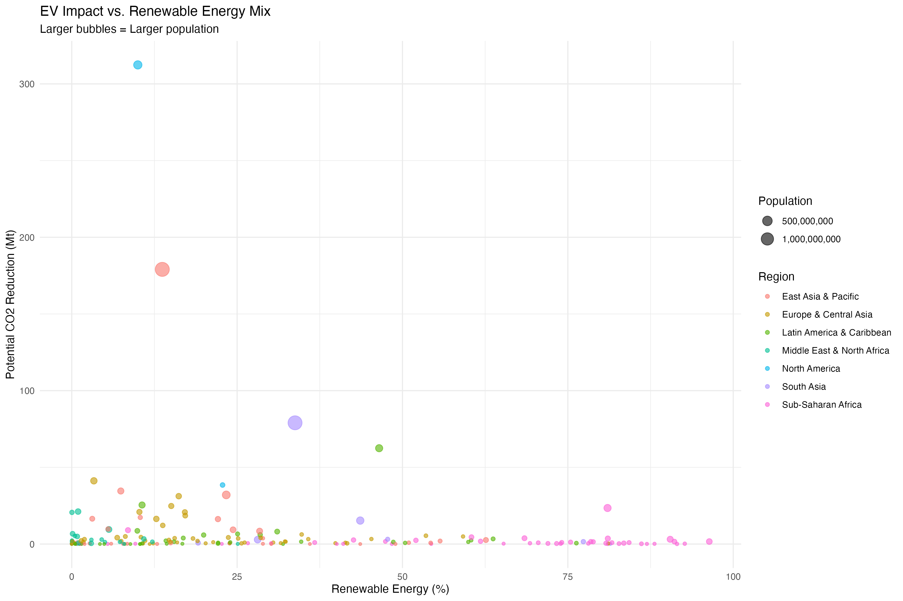
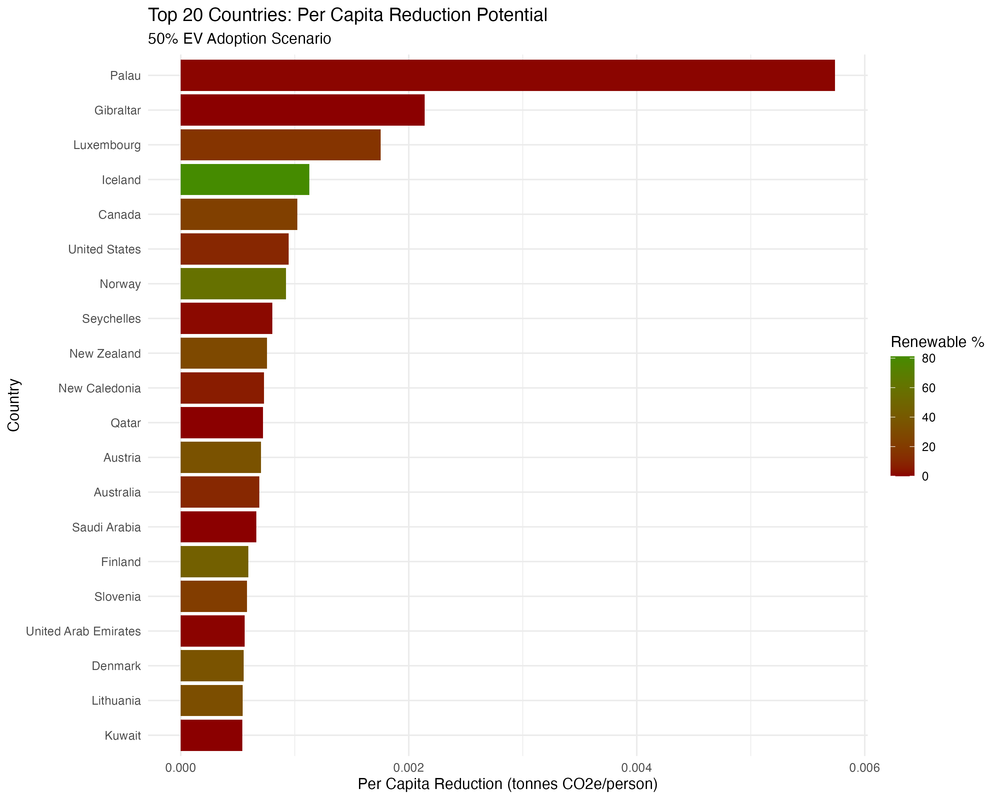

# Question 3: Fermi Problem and Sensitivity Analysis

## Objective

Estimate the impact on global CO2 emissions if 50% of the world's population adopted electric vehicles (EVs), perform sensitivity analysis across different adoption rates, and identify which countries would see the most significant emission reductions.

---

## Methodology

### 1. Proxy Approach for Missing Vehicle Data

**Challenge**: World Bank removed vehicle density indicators (IS.VEH.PCAR.P3, IS.VEH.ROAD.K1, IS.VEH.NVEH.P3) from public databases due to licensing issues.

**Solution**: Used CO2 emissions from transport sector (`EN.GHG.CO2.TR.MT.CE.AR5`) as a proxy for vehicle-related emissions.

**Rationale**: Transport emissions correlate strongly with vehicle ownership and usage patterns, making this a reasonable proxy for emissions that EVs would replace.

**Limitation**: Transport CO2 includes aviation, shipping, and rail. This may overestimate EV impact in countries where non-road transport dominates (e.g., island nations, shipping hubs).

---

### 2. Dataset and Assumptions

**Dataset**:
- **Period**: 2015-2023 (1,728 observations)
- **Countries**: 192 with complete data
- **Key Variables**: Transport CO2, renewable energy %, population, GDP per capita

**Core Assumptions**:

1. **Adoption Rate**: 50% of population adopts EVs (baseline scenario)
2. **Replacement Model**: EVs replace conventional vehicles (not added to fleet)
3. **Efficiency Factor**: EVs are ~70% more efficient than internal combustion engines
4. **Energy Mix Dependency**: Reduction effectiveness depends on renewable energy percentage

**Clean Factor Formula**:

$$\text{Clean Factor} = \left(\frac{\text{Renewable Energy %}}{100} \times 0.7\right) + 0.3$$

- **Minimum** (0% renewable): 0.30 (30% reduction from efficiency only)
- **Maximum** (100% renewable): 1.00 (100% reduction, zero emissions)

---

## Fermi Estimation Results

### Baseline Scenario: 50% EV Adoption

| Metric | Value |
|--------|-------|
| **Total Global Reduction** | **1,374.82 Mt CO2e** |
| Average per Country | 7.16 Mt |
| Median per Country | 1.23 Mt |

---

### Top 10 Countries - Absolute Reduction Potential

| Rank | Country | Income | Current Emissions (Mt) | Reduction (Mt) | Renewable % | Clean Factor |
|------|---------|--------|------------------------|----------------|-------------|--------------|
| 1 | United States | High | 1,689 | 312.1 | 10.0 | 0.370 |
| 2 | China | Upper middle | 905 | 178.7 | 13.7 | 0.396 |
| 3 | India | Lower middle | 295 | 79.0 | 33.8 | 0.536 |
| 4 | Brazil | Upper middle | 200 | 62.5 | 46.5 | 0.625 |
| 5 | Russian Federation | High | 255 | 41.2 | 3.3 | 0.323 |
| 6 | Canada | High | 167 | 38.5 | 22.8 | 0.460 |
| 7 | Japan | High | 197 | 34.6 | 7.4 | 0.352 |
| 8 | Indonesia | Upper middle | 138 | 32.0 | 23.4 | 0.463 |
| 9 | Germany | High | 151 | 31.2 | 16.2 | 0.413 |
| 10 | Mexico | Upper middle | 136 | 25.5 | 10.6 | 0.374 |

*Full ranking (192 countries) available at: `results/tables/ev_impact_analysis.csv`*

---

## Key Findings

### 1. Volume vs. Efficiency Trade-off

**High-Volume, Low-Efficiency** (USA, China, Russia):

- USA leads with 312 Mt reduction but Clean Factor only 0.37 (10% renewable)
- Each EV reduces only 37% of theoretical maximum due to fossil fuel grid
- High impact driven by massive baseline emissions (1,689 Mt), not efficiency

**Low-Volume, High-Efficiency** (Nigeria, Brazil):

- Nigeria: 24 Mt reduction but Clean Factor 0.87 (81% renewable energy)
- Each Nigerian EV reduces 2.3x more CO2 than each US EV
- Lower absolute impact due to smaller transport sector (54 Mt baseline)

**Policy Implication**: Countries with high emissions but low renewables (USA, China, Saudi Arabia) require dual investment: EV adoption + grid decarbonization.

---

### 2. Income Level Patterns

**High-Income Countries** (13 of top 20):

- Average Clean Factor: 0.38 (low due to fossil fuel grids)
- High absolute emissions but limited efficiency
- Examples: USA (0.37), Japan (0.35), Saudi Arabia (0.30)

**Developing Countries** (India, Indonesia, Nigeria):

- Average Clean Factor: 0.62 (higher renewable energy %)
- Greater reduction per EV due to cleaner grids
- Examples: Nigeria (0.87), Brazil (0.63), India (0.54)

---

### 3. Key Drivers of Emission Reduction

Analysis reveals three primary drivers:

1. **Current Transport Emissions** (determines absolute impact)
   - USA: 1,689 Mt → largest absolute reduction (312 Mt)
   
2. **Renewable Energy Percentage** (determines efficiency)
   - Nigeria: 81% renewable → highest Clean Factor (0.87)
   
3. **Population Size** (scales adoption impact)
   - China/India: Large populations amplify total reduction

**Critical Insight**: Renewable energy % is the differentiating factor between moderate impact (Clean Factor ~0.30-0.40) and high impact (Clean Factor ~0.60-0.90).

---

## Sensitivity Analysis

### Scenario Comparison: 30% to 70% EV Adoption

| Adoption Rate | Total Global Reduction (Mt) | % Change from Baseline |
|---------------|----------------------------|------------------------|
| 30% | 825 | -40% |
| 40% | 1,100 | -20% |
| **50% (Baseline)** | **1,375** | **0%** |
| 60% | 1,650 | +20% |
| 70% | 1,925 | +40% |

**Key Observation**: Linear relationship confirmed. Each 10% increase in adoption → ~275 Mt additional reduction globally.

---

## Visualizations

### Figure 1: Top 20 Countries by Reduction Potential

*High-income countries (red) dominate due to high baseline emissions, but low renewable energy limits effectiveness.*

---

### Figure 2: Sensitivity Analysis - Adoption Scenarios

*Linear scaling from 825 Mt (30%) to 1,925 Mt (70%) validates Fermi estimation approach.*

---

### Figure 3: Renewable Energy vs. Reduction Potential

*Bubble size = population. Upper-left quadrant (USA, China): High volume, low efficiency. Upper-right quadrant (Brazil, India): Optimal balance of scale and efficiency.*

---

### Figure 4: Per Capita Reduction Leaders

*Small, wealthy nations lead per capita reductions, but large nations (USA, China, India) determine global impact due to scale.*

---

## Answer to Research Question

**"Which countries would see the most significant reduction in emissions, and by how much?"**

### By Absolute Reduction (Volume):

**Top 5**:

1. USA: 312 Mt (18.5% of transport emissions)
2. China: 179 Mt (19.7% of transport emissions)
3. India: 79 Mt (26.8% of transport emissions)
4. Brazil: 63 Mt (31.1% of transport emissions)
5. Russia: 41 Mt (16.1% of transport emissions)

**Combined**: These 5 countries account for 674 Mt (49% of total global reduction)

### By Efficiency (Clean Factor):

**Top 3**:

1. Nigeria: 0.87 (81% renewable)
2. Brazil: 0.63 (47% renewable)
3. India: 0.54 (34% renewable)

These countries achieve 1.5-2.3x more reduction per EV than fossil fuel grid countries.

---

## Policy Implications

### 1. Dual Strategy for High-Emission, Low-Renewable Countries

**USA, China, Russia, Saudi Arabia** must pursue simultaneous investments:

- **Phase 1**: EV incentives + renewable energy expansion → Target 30% EV adoption + 25% renewable
- **Phase 2**: EV mandates + continue grid decarbonization → Target 50% EV adoption + 50% renewable 

**Impact Example (USA)**: Increasing renewable energy 10% → 50% would boost reduction from 312 Mt → 548 Mt (76% increase) with same EV adoption.

### 2. Aggressive EV Targets for High-Renewable Countries

**Brazil, Nigeria, India, Indonesia** already have favorable conditions:

- Clean grids enable immediate high-impact EV adoption
- Lower policy risk (EVs deliver maximum climate benefit)
- Can serve as international models

### 3. Investment Prioritization Framework

**Tier 1** (High emissions + High renewable): Brazil

- Ready for rapid EV scaling
- Maximum immediate climate impact

**Tier 2** (High emissions + Moderate renewable): India, Indonesia

- Require moderate renewable investment alongside EV adoption
- Balanced approach

**Tier 3** (High emissions + Low renewable): USA, China

- Major grid transformation required
- Sequential EV-only approach yields suboptimal results

---

## Limitations and Assumptions

### Key Limitations:

1. **Proxy Data**: Transport CO2 includes aviation/shipping (may overestimate road transport impact)
2. **Static Energy Mix**: Assumes renewable % constant (reality: grids decarbonizing rapidly)
3. **Uniform Adoption**: 50% applied universally (reality: urban/rural and income disparities)
4. **Operational Emissions Only**: Excludes EV manufacturing emissions (battery production is carbon-intensive)
5. **Grid Capacity**: Assumes sufficient electricity generation (large-scale EV adoption requires capacity increases)

### Assumptions Made:

1. **Road Transport Dominance**: Assumed majority of transport CO2 from road vehicles
2. **EV Efficiency**: 70% more efficient than combustion engines (based on literature)
3. **Replacement Model**: EVs replace existing vehicles (not added to fleet)
4. **Clean Factor Formula**: Linear relationship between renewable % and emission reduction

**Impact of Limitations**: Analysis likely overestimates reduction in some countries (aviation-heavy economies) and underestimates in others (rapidly decarbonizing grids). Net global estimate remains robust due to averaging across 192 countries.

---

## Conclusion

### Summary of Findings

50% global EV adoption could reduce transport CO2 emissions by **1,375 Mt annually**, but effectiveness varies dramatically:

1. **Absolute leaders** (USA: 312 Mt, China: 179 Mt): Highest potential due to massive transport emissions, but limited by fossil fuel grids (Clean Factor ~0.30-0.40)

2. **Efficiency leaders** (Nigeria: 0.87, Brazil: 0.63): Achieve 2-3x more reduction per EV due to high renewable energy percentages

3. **Linear scaling**: Each 10% increase in adoption → ~275 Mt additional reduction (825 Mt at 30% → 1,925 Mt at 70%)

4. **Critical insight**: EV adoption alone achieves only 30-40% of potential in countries with <20% renewable energy

### Strategic Recommendation

**Integrated approach required**: EV policies must be coordinated with electricity sector decarbonization. Countries investing in EVs without addressing grid composition risk minimal emissions reduction while incurring significant costs.

**Path forward**: EV adoption + renewable energy expansion as complementary, simultaneous investments—not sequential.

---

## Files Generated

**Analysis Results**:

- `results/tables/ev_impact_analysis.csv`: Complete country-level estimates (192 countries)
- `results/tables/sensitivity_analysis.csv`: Results for 30%-70% adoption scenarios

**Visualizations**:

- `results/figures/top20_reduction_potential.png`
- `results/figures/sensitivity_scenarios.png`
- `results/figures/renewable_vs_reduction.png`
- `results/figures/top20_percapita_reduction.png`