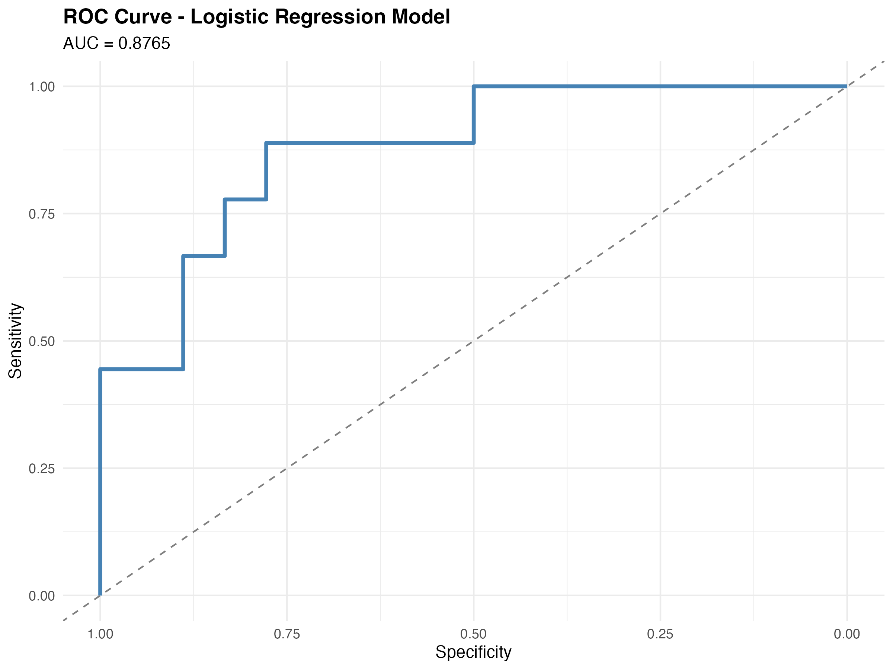
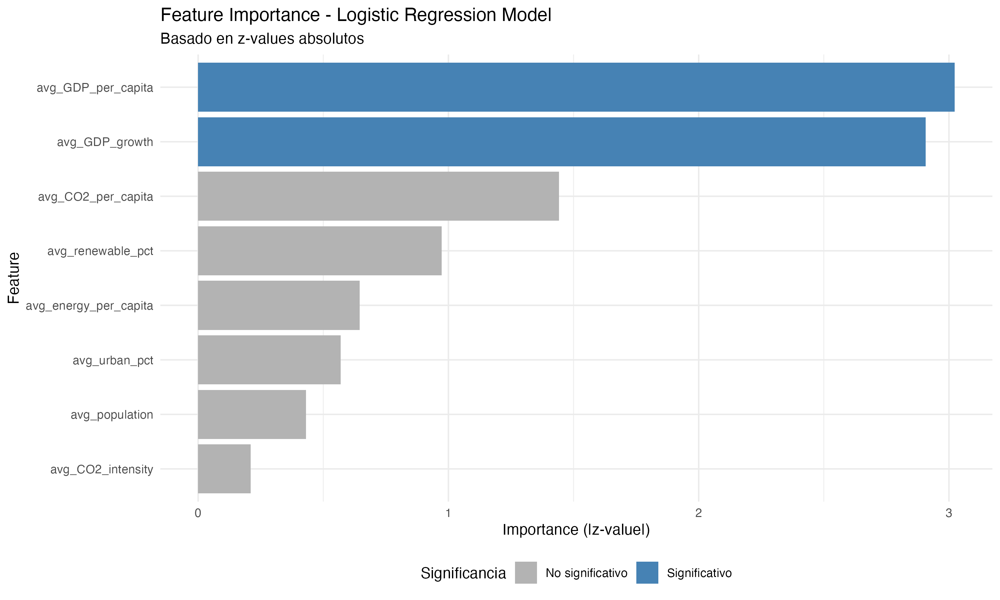
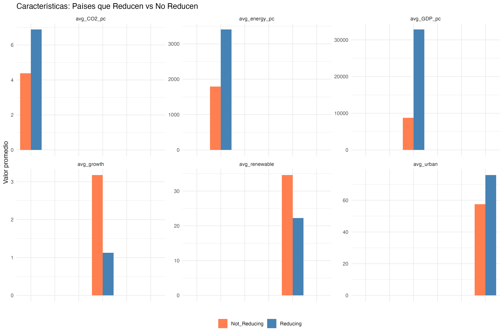
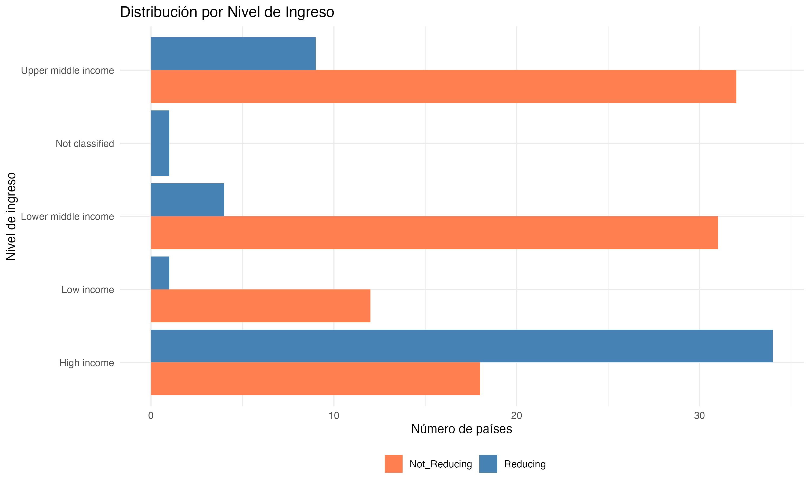
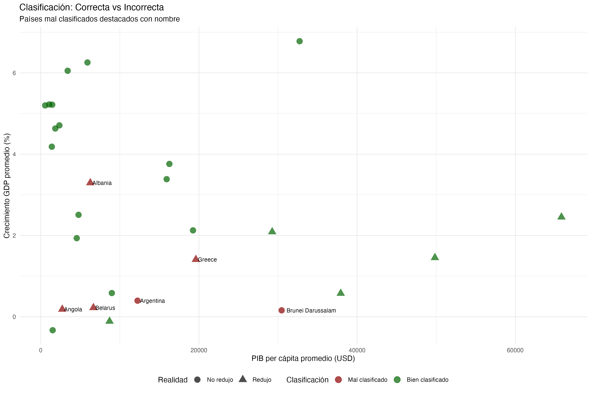

# Question 4: Classification and Policy Implications

## Objective

Build a classifier to identify countries likely to achieve significant CO2 emission reductions in the next decade and answer: "What are the common characteristics of countries that successfully reduce emissions, and how can policymakers in other nations apply these insights?".

---

## Methodology

### 1. Target Variable Definition

**Binary Classification**:

- **"Reducing" (1)**: Countries that reduced CO2 emissions by more than 5% between 2015-2017 and 2021-2023
- **"Not Reducing" (0)**: Countries that increased emissions or reduced by less than 5%

**Calculation Method**:
$$\text{CO2 Change (%)} = \frac{\text{CO2}_{2021-2023} - \text{CO2}_{2015-2017}}{\text{CO2}_{2015-2017}} \times 100$$

**Dataset Distribution**:

- Total countries: 142 (with complete data)
- Reducing: 49 countries (34.5%)
- Not Reducing: 93 countries (65.5%)

---

### 2. Feature Selection and Model Training

**Eight predictors** (averaged 2015-2023): GDP per capita, renewable energy %, energy per capita, urbanization %, CO2 per capita, CO2 intensity, population, GDP growth.

**Algorithm**: Logistic Regression

**Train/Test Split**: 80/20 (115 train, 27 test countries, stratified by target)

---

## Model Performance

### Classification Metrics

| Metric | Value | Interpretation |
|--------|-------|----------------|
| **Accuracy** | 77.78% | Correct predictions on 21 of 27 test countries |
| **Sensitivity** | 55.56% | Detected 5 of 9 countries that reduced |
| **Specificity** | 88.89% | Correctly identified 16 of 18 countries that did not reduce |
| **AUC** | 0.8765 | Very good discriminatory ability |
| **Kappa** | 0.4706 | Moderate agreement beyond chance |

**Confusion Matrix**:

|  | **Actual: Not Reducing** | **Actual: Reducing** |
|---|---|---|
| **Predicted: Not Reducing** | 16 | 4 |
| **Predicted: Reducing** | 2 | 5 |

**Key Insight**: Model excels at identifying countries that will NOT reduce (88.9% specificity) but more conservative detecting successful reducers (55.6% sensitivity).

*AUC = 0.8765 indicates very good model performance, significantly better than random guessing (AUC = 0.50).*

---

## Feature Importance

### Statistical Significance

Only **two features** are statistically significant predictors (p < 0.01):

| Feature | Coefficient | P-value | Interpretation |
|---------|------------|---------|----------------|
| **avg_GDP_per_capita** | +0.00009 | 0.0025** | Wealthier countries more likely to reduce |
| **avg_GDP_growth** | -0.3965 | 0.0037** | Rapidly growing economies less likely to reduce |

**Non-significant features** (p > 0.10): Renewable energy %, energy per capita, urbanization %, CO2 per capita, CO2 intensity, population.

**Surprising Result**: Renewable energy percentage NOT significant despite expectations, likely due to correlation with GDP per capita.

---

## Common Characteristics of Successful Countries

### Quantitative Comparison

| Characteristic | **Reducing** (n=49) | **Not Reducing** (n=93) | Difference |
|----------------|---------------------|-------------------------|------------|
| Avg GDP per capita | $32,830 | $8,763 | **+274%** |
| Avg GDP growth | 1.12% | 3.18% | **-65%** |
| Avg renewable % | 22.2% | 34.6% | -36% |
| Avg urbanization | 75.9% | 57.5% | +32% |
| Avg CO2 per capita | 6.88 tons | 4.39 tons | +57% |

---

### Income Level Distribution

| Income Level | Reducing | Not Reducing | % Reducing |
|--------------|----------|--------------|------------|
| **High income** | 34 | 18 | **65.4%** |
| Upper middle | 9 | 32 | 22.0% |
| Lower middle | 4 | 31 | 11.4% |
| Low income | 1 | 12 | 7.7% |

**Critical Finding**: 69% of reducing countries are high-income, while 68% of non-reducing countries are middle/low-income.

---

### Top 10 Most Successful Reducers

| Country | Income | Reduction | GDP per capita | GDP Growth |
|---------|--------|-----------|----------------|------------|
| Lebanon | Lower middle | -54.8% | $6,581 | -3.96% |
| Venezuela | Not classified | -46.2% | $3,088 | -11.5% |
| Estonia | High | -38.0% | $23,930 | 2.15% |
| Ukraine | Upper middle | -34.0% | $3,485 | -2.42% |
| Portugal | High | -26.3% | $22,977 | 2.23% |
| Finland | High | -22.4% | $48,368 | 0.99% |
| Greece | High | -22.3% | $19,612 | 1.41% |
| Netherlands | High | -20.9% | $53,986 | 2.08% |

**Two Distinct Pathways**:

1. **Policy-driven** (Estonia, Portugal, Finland, Netherlands): High income, stable growth, proactive climate policy
2. **Crisis-driven** (Lebanon, Venezuela, Ukraine): Economic collapse, not sustainable models

---

## Classification Errors

### 6 Misclassified Countries

**False Positives (2)** 

- Predicted reduction, but increased:
  - **Brunei**: +26.3% (oil-dependent economy)
  - **Argentina**: -1.91% (below threshold, economic instability)

**False Negatives (4)** 

- Predicted no reduction, but reduced:
  - **Greece**: -22.3% (debt crisis-driven)
  - **Belarus**: -5.66% (low GDP per capita)
  - **Angola**: -13.8% (post-conflict restructuring)
  - **Albania**: -6.20% (high hydropower despite growth)

**Pattern**: Errors cluster in $0-$20k GDP per capita range where model uncertainty is highest. Model struggles with crisis-driven reductions and resource-dependent economies.

---

## Key Drivers of Emission Reduction

### Primary Driver: Economic Development Stage

Countries reduce emissions when they:

1. Achieve high income (>$15,000 GDP per capita)
2. Experience growth slowdown (<2% annual growth)
3. Have fiscal capacity to invest in clean technology

**Mechanism**:

- **Early development** (GDP < $10k): Growth prioritized over environment
- **High income** (>$20k): Environmental quality becomes political priority

**Quantitative Evidence**:

- Each $10,000 GDP increase → 90% higher odds of reducing
- Each 1% growth increase → 33% lower odds of reducing

---

## Policy Implications and Recommendations

### Income-Appropriate Strategies

**High-Income Countries** (>$15,000 GDP per capita):

**Priority Actions**:

- Carbon pricing (tax or cap-and-trade)
- Phase out fossil fuel subsidies
- Renewable energy mandates
- Electric vehicle infrastructure

**Why these work**: High income + low growth = fiscal space + political will.

**Examples**: Portugal (-26%), Finland (-22%), Netherlands (-21%)

---

**Middle-Income Countries** ($5,000-$15,000):

**Balanced Approach**:

- Growth-compatible policies (avoid economic drag)
- Targeted interventions (renewable zones, efficiency standards)
- International climate finance
- Technology transfer agreements

**Risk**: Aggressive targets may slow development.

**Example**: Albania (-6.2% while maintaining 3.3% growth via hydropower)

---

**Low-Income Countries** (<$5,000):

**Development-First Strategy**:

- Renewable energy for new infrastructure (avoid fossil lock-in)
- Leapfrog to clean technology where cost-competitive
- Prioritize adaptation over mitigation
- Seek climate finance for co-benefits

**Evidence**: Only 1 of 13 low-income countries achieved >5% reduction.

---

### Growth Management and Timing

**Key Insight**: Every 1% GDP growth increase reduces reduction probability by 33%.

**Strategic Responses**:

1. **Decouple growth from emissions**: Service sector development, energy efficiency, circular economy
2. **Policy timing**: Implement ambitious climate policies during low-growth periods; invest in green infrastructure during high-growth periods
3. **Avoid crisis pathways**: Economic collapse (Lebanon -55%, Venezuela -46%) is not a climate solution

---

### International Climate Policy Framework

**Recommendation**: Differentiated targets based on development stage

- **High-income**: Absolute emission reductions (e.g., -50% by 2030)
- **Middle-income**: Emission intensity reductions (CO2 per GDP)
- **Low-income**: Renewable energy deployment (% of total energy)

**Rationale**: Model shows income is strongest predictor. One-size-fits-all targets ignore economic realities and risk political backlash.

---

## Answer to Research Question

**"What are the common characteristics of countries that successfully reduce emissions?"**

**Primary Characteristics**:

- **High GDP per capita**: $32,830 average (3.7x higher than non-reducers)
- **Low GDP growth**: 1.1% average (65% lower than non-reducers)
- **High-income status**: 69% are high-income economies

**Only 2 of 8 features** statistically significant: GDP per capita (+) and GDP growth (-).

---

**"How can policymakers in other nations apply these insights?"**

**Strategic Framework**:

1. **Assess development stage**: Income level determines policy ambition
2. **Time interventions**: Low-growth periods for climate policy, high-growth periods for green investment
3. **Context-appropriate strategies**: Policies effective in Portugal (GDP $23k) may fail in Kenya (GDP $2k)
4. **International support**: Developing countries need financial/technical assistance to reduce while maintaining growth

**Realistic Expectation**: Emission reduction is primarily a high-income phenomenon. Model suggests attempting aggressive reductions before ~$15,000 GDP per capita risks economic and political backlash. Context-appropriate strategies, not universal prescriptions, offer best chance of global success.

---

## Limitations

**Model Limitations**:

- Limited predictive power for middle-income countries ($5k-$20k range)
- Cannot distinguish policy-driven vs crisis-driven reductions
- Omitted variables: policy quality, political system, institutional capacity

**Data Limitations**:

- CO2 measurement varies by country quality
- 9-year observation period (short for long-term trends)
- Survival bias (conflict zones, failed states excluded)

---

## Files Generated

**Model Results**:

- `results/tables/Q4_model_metrics.csv`
- `results/tables/Q4_feature_importance.csv`
- `results/tables/Q4_test_predictions.csv`
- `results/tables/Q4_comparison_reducing_vs_not.csv`
- `results/tables/Q4_top_reducers.csv`

**Visualizations**:

- `results/figures/Q4_feature_importance.png`
- `results/figures/Q4_roc_curve.png`
- `results/figures/Q4_classification_errors.png`
- `results/figures/Q4_comparison_characteristics.png`
- `results/figures/Q4_income_distribution.png`