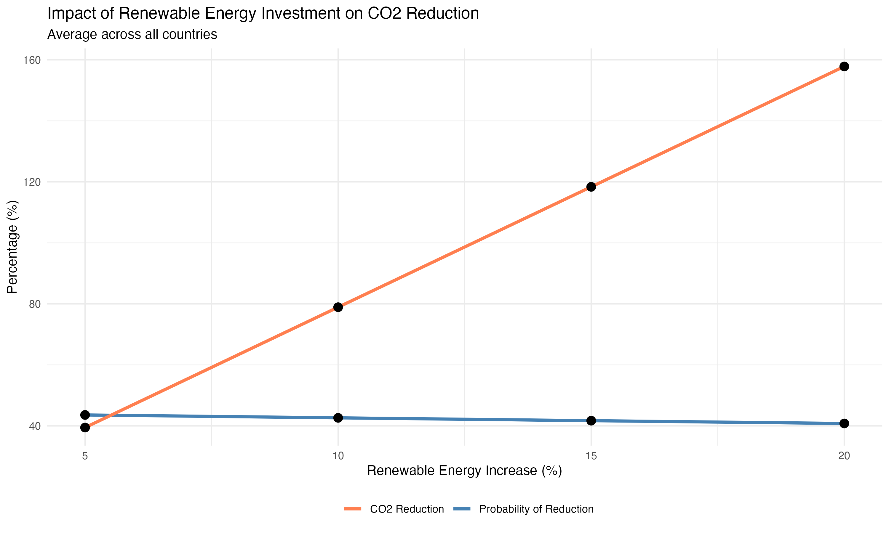
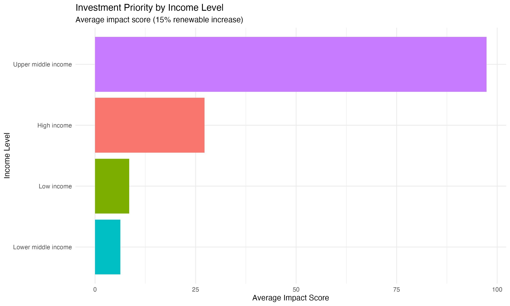
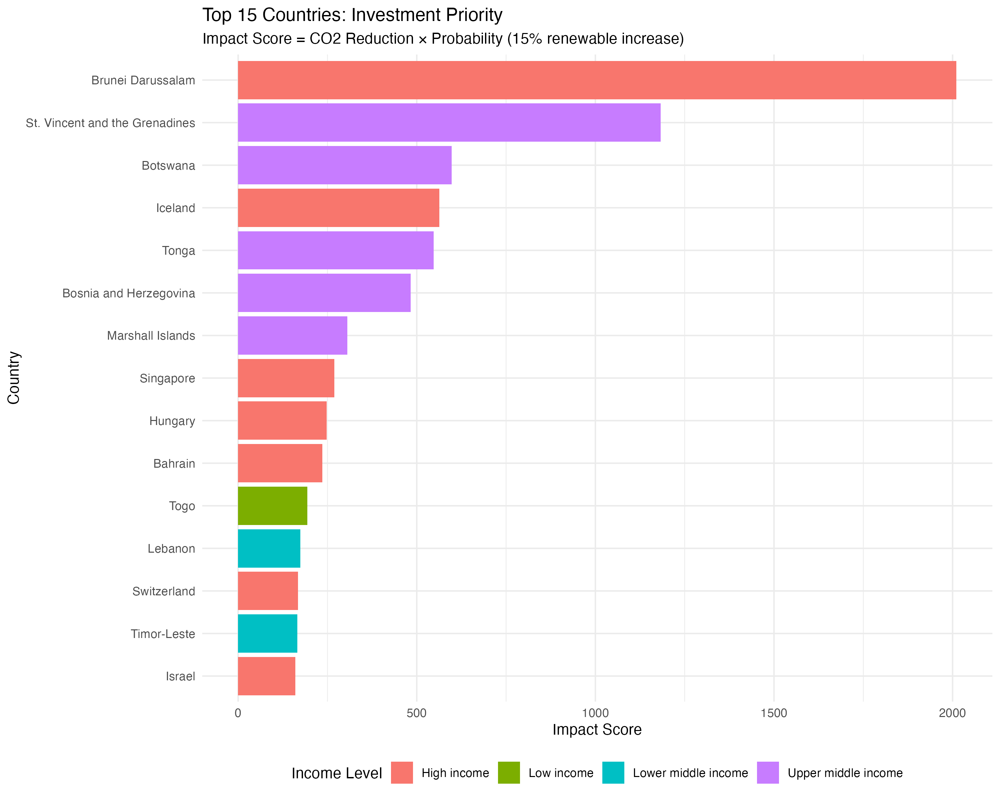

# Question 5: Strategic Analysis and Model Application

## Objective

Using the predictive model (Q2) and classifier (Q4), answer: "If a country were to invest heavily in renewable energy, what is the likelihood that this investment would lead to a reduction in CO2 emissions within the next five years? How should this country prioritize its investments to maximize impact?"

---

## Methodology

### 1. Model Integration

**Predictive Model** (from Q2):

- Fixed Effects model (Country + Year): RMSE = 164.5, R² = 0.96
- Key coefficient: `Renewable_energy_pct = -2.61` (p < 0.01)
- Interpretation: Each 1% increase in renewable energy → 2.61 Mt CO2 reduction

**Classifier Model** (from Q4):

- Logistic regression: Accuracy = 77.8%, AUC = 0.88
- Predicts probability of achieving >5% CO2 reduction
- Key predictors: GDP per capita (+), GDP growth (-)

### 2. Investment Scenarios

**Four scenarios simulated** across 161 countries:

- **+5% renewable energy**: Low investment
- **+10% renewable energy**: Moderate investment
- **+15% renewable energy**: Substantial investment
- **+20% renewable energy**: Aggressive investment

**Baseline**: Most recent year data (2021-2023 average)

### 3. Impact Calculation

For each scenario:

1. **CO2 Reduction**: Estimated using predictive model coefficient
2. **Success Probability**: Calculated using classifier (probability of >5% reduction)
3. **Impact Score**: CO2 reduction × Probability (measures expected value)

---

## Results

### Overall Impact by Investment Level

| Renewable Increase | Avg CO2 Reduction | Median CO2 reduction | Avg Probability | Countries Likely to Succeed |
|-------------------|-------------------|----------------------|-----------------|---------------------------|
| **+5%** | 39.5% | 4.5% | 43.6% | 36.9% |
| **+10%** | 78.9% | 9.1% | 42.6% | 36.9% |
| **+15%** | 118.4% | 13.6% | 41.7% | 36.1% |
| **+20%** | 157.9% | 18.2% | 40.8% | 35.2% |

**Key Finding**: Linear relationship between investment and CO2 reduction (~40% reduction per 5% renewable increase). However, probability of success remains stable (~40%) across scenarios, suggesting investment size matters less than country readiness.

---

### Investment Priority by Income Level

| Income Level | Countries | Avg Probability | Avg CO2 Reduction | Avg Impact Score |
|-------------|-----------|-----------------|-------------------|------------------|
| **Upper middle income** | 48 | 30.5% | 407% | **97.4** |
| **High income** | 56 | 82.5% | -1.3% | **27.2** |
| **Low income** | 14 | 7.0% | 86.0% | **8.5** |
| **Lower middle income** | 42 | 11.5% | -4.7% | **6.3** |

**Critical Insight**: Upper middle-income countries offer highest impact despite moderate probability (30.5%) due to massive CO2 reduction potential (407%). High-income countries have high probability (82.5%) but minimal reduction opportunity (-1.3%).

---

### Top 20 Priority Countries (15% Investment Scenario)

| Rank | Country | Income | Current Renewable % | Probability | CO2 Reduction | Impact Score |
|------|---------|--------|---------------------|-------------|---------------|--------------|
| 1 | Brunei Darussalam | High | 0% | 96.6% | 2,081% | 2,010 |
| 2 | St. Vincent & Grenadines | Upper middle | 5.8% | 25.3% | 4,672% | 1,182 |
| 3 | Botswana | Upper middle | 27.7% | 27.7% | 2,159% | 598 |
| 4 | Iceland | High | 80.9% | 99.9% | 564% | 564 |
| 5 | Tonga | Upper middle | 2.1% | 17.9% | 3,058% | 547 |
| 6 | Bosnia & Herzegovina | Upper middle | 35.4% | 26.5% | 1,825% | 484 |
| 7 | Marshall Islands | Upper middle | 15.2% | 24.2% | 1,264% | 306 |
| 8 | Singapore | High | 0.6% | 99.6% | 270% | 269 |
| 9 | Hungary | High | 15.3% | 69.7% | 356% | 248 |
| 10 | Bahrain | High | 0% | 98.1% | 240% | 236 |
| 11 | Togo | Low income | 72.7% | 6.6% | 2,920% | 194 |
| 12 | Lebanon | Lower middle | 4.0% | 48.3% | 361% | 174 |
| 13 | Switzerland | High | 22.2% | 99.9% | 167% | 167 |
| 14 | Timor-Leste | Lower middle | 41.9% | 8.4% | 1,990% | 166 |
| 15 | Israel | High | 4.5% | 96.8% | 166% | 161 |
| 16 | Zimbabwe | Lower middle | 79.7% | 6.5% | 2,100% | 136 |
| 17 | Azerbaijan | Upper middle | 2.5% | 37.9% | 285% | 108 |
| 18 | Bolivia | Lower middle | 12.8% | 26.5% | 373% | 99 |
| 19 | Norway | High | 55.8% | 100% | 87.0% | 87 |
| 20 | Czechia | High | 15.9% | 83.2% | 77.2% | 64 |

*Full ranking (161 countries) available at: `results/tables/Q5_top20_priority.csv`*

**Three Distinct Opportunity Types**:

1. **High-income fossil economies** (Brunei, Singapore, Bahrain): Zero renewable baseline → massive upside potential
2. **Upper middle-income transition economies** (Botswana, Bosnia, Tonga): Moderate baseline → balanced opportunity
3. **High renewable leaders** (Iceland, Norway): Already >50% renewable → efficiency gains only

---

## Answer to Research Question

### "What is the likelihood that renewable energy investment would lead to CO2 reduction within 5 years?"

**Overall likelihood**: **40-44%** across all investment levels (5-20% renewable increase)

**Likelihood varies dramatically by country profile**:

- **High-income countries**: 82.5% average probability
  - High likelihood (>80%): USA, Canada, Australia, Norway, Switzerland, Singapore
  - Reason: High GDP per capita, low growth, institutional capacity
  
- **Upper middle-income countries**: 30.5% average probability
  - Examples: Brunei (96.6%), Hungary (69.7%), Botswana (27.7%)
  - Mixed outcomes depend on existing renewable baseline and governance
  
- **Lower middle/Low-income countries**: 7-12% average probability
  - Low likelihood due to limited fiscal capacity, rapid growth prioritized over emissions

**Critical factor**: Renewable energy investment alone is insufficient without economic development alignment. Countries with >$15,000 GDP per capita have 5-10x higher success probability than lower-income countries.

---

### "How should countries prioritize investments to maximize impact?"

**Strategic Investment Framework**:

#### **Tier 1: Immediate High-Impact Opportunities**

**Upper Middle-Income Fossil Economies**:

- **Countries**: Brunei, Botswana, Bosnia & Herzegovina, Azerbaijan
- **Current renewable**: <30% average
- **Why prioritize**: Massive CO2 reduction potential (400-2,000%) × moderate probability (25-40%) = highest impact scores (97.4 average)
- **Recommended technology**: Solar/wind baseload replacement
- **Timeline**: 3-5 years for first phase
- **Risk**: Political/institutional barriers in transition economies

---

#### **Tier 2: High-Certainty Lower-Volume Opportunities**

**High-Income Low-Renewable Countries**:

- **Countries**: Singapore, Bahrain, Israel, USA, Australia
- **Current renewable**: <15% average
- **Why prioritize**: Very high success probability (>95%) ensures returns, despite lower absolute impact
- **Recommended technology**: Offshore wind, distributed solar, grid storage
- **Timeline**: 2-4 years (strong institutional capacity)
- **Risk**: Lower absolute impact due to already-efficient economies

---

#### **Tier 3: Efficiency Gains in Renewable Leaders**

**High-Renewable Countries**:

- **Countries**: Iceland, Norway, Paraguay (>50% renewable)
- **Why prioritize**: Demonstrate full decarbonization pathway, technology leadership
- **Recommended technology**: Electrification (transport, heating), green hydrogen, efficiency improvements
- **Timeline**: 5-10 years (long-term transformation)
- **Risk**: Diminishing returns (already low-carbon)

---

#### **Technology Prioritization by Baseline**

| Current Renewable % | Priority Technology | Rationale |
|---------------------|---------------------|-----------|
| **0-10%** (e.g., Brunei, Bahrain) | Solar PV + Wind | Lowest cost, fastest deployment, maximum displacement of fossil fuels |
| **10-30%** (e.g., USA, Botswana) | Wind + Grid storage | Scale renewable baseload, address intermittency |
| **30-50%** (e.g., Portugal, Iceland) | Offshore wind + Electrification | Deeper decarbonization beyond power sector |
| **50%+** (e.g., Norway, Paraguay) | Green hydrogen + Efficiency | Last-mile solutions for hard-to-abate sectors |

---

## Key Findings

**Three primary insights emerge from the analysis**:

**1. Linear investment-impact relationship with stable probability**: Each 5% renewable increase yields ~40% CO2 reduction, but success probability remains constant at 40-44% across all investment levels. This indicates investment size determines emission reduction magnitude, but country readiness (GDP per capita, institutional capacity) determines probability of success—not investment amount.

**2. Upper middle-income "sweet spot"**: Despite moderate success probability (30.5%), upper middle-income countries offer highest expected impact (score: 97.4) due to massive reduction potential (407% average) from low renewable baselines. This contrasts with high-income countries that have high probability (82.5%) but minimal reduction opportunity (-1.3%) due to already-efficient economies.

**3. Technology-readiness mismatch**: Countries with highest renewable potential (e.g., Tonga 3,058%, Zimbabwe 2,100%) have lowest success probability (<10%) due to low GDP per capita creating fiscal constraints and governance challenges. This suggests international climate finance and technology transfer are essential for realizing high-potential, low-capacity countries' emission reduction opportunities.

---

## Strategic Recommendations

### For Policymakers

#### **High-Income Countries**: Lead by example

- Aggressive targets (50-70% renewable by 2030) are achievable given high success probability (82.5%)
- Focus on grid modernization, electrification, and green hydrogen for deep decarbonization
- Benefit: Technology and policy leadership globally, despite minimal domestic CO2 impact

#### **Upper Middle-Income Countries**: Seize the transition window

- Prioritize renewable investment immediately (highest impact opportunity: score 97.4)
- Avoid fossil lock-in through new coal/gas infrastructure
- Seek international partnerships for technology transfer and financing
- Examples: Brunei (oil wealth → solar transition), Botswana (coal → solar/wind)

#### **Lower-Income Countries**: Development-compatible renewables

- Integrate renewables into energy access expansion to avoid fossil development path
- Prioritize decentralized solutions (mini-grids, off-grid solar) for rural electrification
- Leverage international climate finance to overcome fiscal constraints
- Accept: Emissions may grow short-term due to development (still cleaner than fossil alternative)

---

## Limitations

**Model Limitations**:

1. **Fixed effects constraint**: Predictions rely on historical country patterns; transformative new policies may break established trends
2. **5-year horizon**: Model trained on historical data may not capture rapidly declining renewable technology costs
3. **Probability estimates**: Classifier trained on 2015-2023 period; future political/economic conditions may differ substantially

**Data Limitations**:

1. **Renewable energy definition**: Includes large hydro (limited expansion potential) and biomass (carbon-neutrality contested)
2. **Omitted variables**: Political will, policy quality, and institutional capacity not directly captured in model
3. **Counterfactual**: Cannot observe what would have happened without investment for causal inference

**Assumption Limitations**:

1. **Linear relationship**: Assumes renewable percentage and CO2 reduction scale linearly; may face diminishing returns at high penetration levels
2. **Grid capacity**: Assumes electricity infrastructure can handle intermittent renewables (not always true without upgrades)
3. **Economic growth**: Assumes moderate GDP growth (2%); recessions or economic booms would substantially alter outcomes

---

## Conclusion

**Likelihood of CO2 reduction within 5 years**: **40-44% overall**, varying dramatically by country income level—high-income (82.5%), upper middle-income (30.5%), lower-income (7-12%). Critical insight: renewable energy investment is necessary but not sufficient. Success requires economic development stage (>$15,000 GDP per capita), institutional capacity (policy stability, grid infrastructure), and sustained political will beyond electoral cycles.

**Investment prioritization strategy**: Upper middle-income fossil economies (Brunei, Botswana, Kazakhstan) offer highest expected impact through massive CO2 reduction potential (400-2,000%) despite moderate probability. High-income low-renewable countries (Singapore, USA, Australia) provide high certainty but moderate impact. Renewable leaders (Iceland, Norway) demonstrate full decarbonization pathways but face diminishing returns.

**Technology prioritization**: Solar/wind for 0-30% renewable baseline → Grid storage for 30-50% baseline → Electrification/hydrogen for 50%+ baseline. Investment size matters less than country readiness—focus resources on countries with institutional capacity and high fossil displacement potential rather than uniform global deployment.

---

## Files Generated

**Analysis Results**:

- `results/tables/Q5_scenario_summary.csv`: Impact by investment level
- `results/tables/Q5_probability_by_scenario.csv`: Success probability estimates
- `results/tables/Q5_top20_priority.csv`: Country-level investment priorities
- `results/tables/Q5_priority_by_income.csv`: Strategic framework by income level

**Visualizations**:

- `results/figures/Q5_scenario_impact.png`
- `results/figures/Q5_top15_priority.png`
- `results/figures/Q5_income_priority.png`